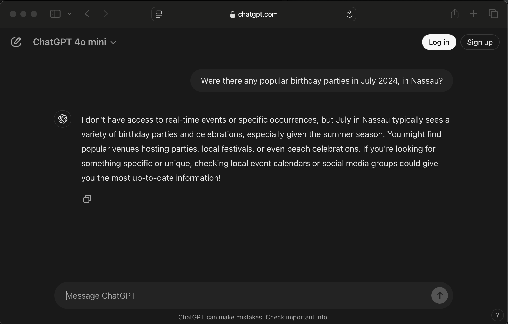

= Asking Questions and Using Data
:chapter: 3

In our last chapter, we explored setting up our project and querying an LLM. In this chapter, we're going to explore two other important aspects of the LLM infrastructure - getting structured data out of them, and feeding data *to* an LLM on demand by way of providing functions.

It may seem odd to think about providing access points to an AI, but this is a crucial lever for applying what the LLMs can do for you.

== Interacting with an AI

For the most part, AIs consist of data and a reasoning process about that data. The model tends to be fairly static, as creating a model is expensive in terms of resources, and models tend to be focused on spheres of knowledge. Most of the popular models, like `gpt4-o` (one of the commercial models from ChatGPT) are huge, and focused on generalized knowledge; they might be good for the questions you ask, or they might not. Other models, like Github's Copilot or the Qwen models, are designed for coding, and some are finely tuned for specific programming languages.

The key feature of all of these, however, is that they *were trained* - note the past tense. Most of them provide information about when they were trained, to give some context to what they know, and many of them will also answer time-sensitive questions about current events by informing you that their training data didn't include recent history.

.Asking an LLM about current events

The LLM isn't _wrong_ - checking local calendars or social media isn't a bad strategy! - but it limits the AI to being a useful but fairly passive research toolfootnote:[What's more, given the nature of how LLMs work, even as a research tool it requires verification, about which most responsible LLMs will explicitly remind you.].

The problem, then, lies in how to provide access of, well, _something_, to the LLM. It's not just _data_ or _current events_, it's a matter of providing interactions to the LLM, such that it can find out something that its knowledge model does not have, or provide functionality that it _shouldn't have_.

This is how one might be able to use ChatGPT as it is *today* to query order status, or perhaps even *make* an order.

== Working with the "Real World"

We can build a working example of something you might find in the real world by thinking of smart lights. There are many commercial examples of smart lightbulbs on the market today, and one can work with them in multiple ways, whether with Alexa, Nest, the custom apps associated with each brand, or home controller applications like openHABfootnote:[openHAB can be found at `https://www.openhab.org/`.] or Home Assistantfootnote:[Home Assistant's home page is `https://www.home-assistant.io/`.].

We're going to build something like openHAB: we're going to create a Spring service to control software "light bulbs" and then we'll provide ways to query and control them through interactions with OpenAI.

NOTE: It would be fairly trivial to take our planned light bulb manager and migrate to work with *actual* light bulbs. This is something one of your authors did for a living. It's actually rather fun, but we're not going to assume our readers have a specific brand of smart lightsfootnote:[The Matter API (`https://developers.home.google.com/matter`) actually helps synchronize a lot of smart device controls, but Matter's API requires a lot of investment, and that's out of the scope of this book. Apart from Matter, you're writing to a set of specific manufacturers' specifications, and that's difficult to generalize and often inconsistent, to boot. Our software emulations carry the day for simplicity and consistency and, well, cost.], or that they want to annoy their wives by changing the lights by fooling around with software, either.

With that said, let's get started. First, we need our directory structure and our `pom.xml`.

Listing {chapter}-{counter:listing}: Creating the directory structure in a POSIX shell
[source,shell]
----
# in a POSIX shell
mkdir -p chapter03/src/{main,test}/{java/ch03,resources}
----

The `pom.xml` is very straightforward. It could have been copied from Chapter 2 with few changes, but we actually have fewer dependencies in Chapter 3 than we did in Chapter 2.

Listing {chapter}-{counter:listing}: `chapter03/pom.xml`
[source,xml]
----
include::../code/chapter03/pom.xml[]
----

Now for the more interesting stuff: our lights. Our basic light abstraction is very simple (and not very accurate, from a real-world light modeling perspective): we have lights, identified by color, that have a state of being "on" or "off."

NOTE: In the real world, smart bulbs have a number of identifying characteristics: IP Addresses, MAC addresses, names, and perhaps zones. They also have more mutable characteristics, *including* color (most of the time!), brightness, and color temperature, and they also can provide metrics for their use. However, none of these attributes help us model calling functions from Spring AI, so we're ignoring them.

== Next Steps

In our next chapter, ...
