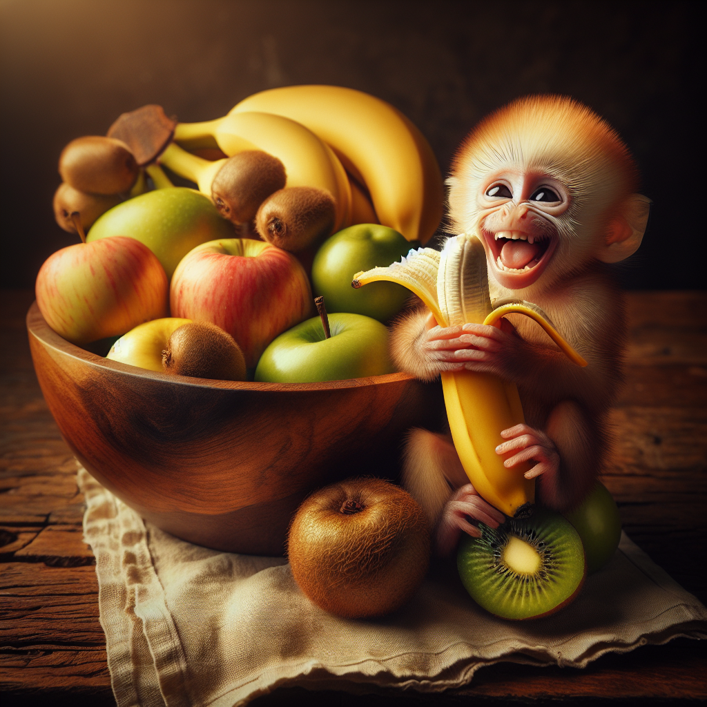

= Generating images
:chapter: 5

== Generating and Recognizing Images
The 1960s were an important time for the process of image recognition and generation similar to what we explored with audio in the previous chapter. Early image recognition using computer vision systems were focused on simple geometric shapes which evolved into techniques like edge detection and template matching. The complexity inherent in an image meant that these early techniques while impressive for their time were unable to deal with anything more than a very structured environment.

Over the years with advancements in usage of neural networks for learning-based approaches and later Support Vector Machines and other feature-based methods the object detection and classification had reached a well-defined commercial appeal especially with faster available hardware. Fast-forward to the last 25 years and the development of Convolutional Neural Networks (CNNs) and advanced GPU processing has exploded the capabilities of image recognition. The techniques utilized in most of the chat models available via Spring AI use some variant of transformers like Vision Transformers to perform their work.

As of this writing the following offerings can perform image recognition via Spring AI:

* OpenAI (e.g. GPT-4 and GPT-4o models)
* Ollama (e.g. LlaVa, Baklava, Llama3.2 models)
* Vertex AI Gemini (e.g. gemini-1.5-pro-001, gemini-1.5-flash-001 models)
* Anthropic Claude 3

Image generation has experienced a similar trajectory and progression over the past 60 years. Early efforts in the 1960s laid the foundation, advancing through the 1980s and 1990s with innovations in 3D modeling, texturing and realistic lighting using mathematically simulated scenes. The field took a significant leap forward in the last 20 years with the invention of Generative Adversarial Networks by Ian Goodfellow, which used two neural networks in tandem to create convincingly realistic images. More recently, the advent of text-to-image generation models, starting with early examples like DALL-E 1, marked another transformative phase. In 2022, diffusion models entered the commercial mainstream with notable releases such as DALL-E 2, Midjourney, and Stable Diffusion, delivering unprecedented realism and image quality.

As of this writing the following are offered by Spring AI for image generation:

* OpenAI
* QianFan
* StabilityAI
* ZhiPuAI

First task we'll do is to create our directory structure for this chapter. This can be created in the "project directory" as in previous chapters with the following command, if you're running a POSIX shell like `bash` or `zsh`:

.Listing {chapter}-{counter:listing}: Creating the project directory structure in POSIX
[source,shell]
----
mkdir -p src/{main,test}/{java,resources}
----

This is _this chapter's_ project file, and thus it's in a directory _under_ the top level directory, called `chapter05`, and the file is named `pom.xml`. A few items to note here, just as in chapter 4 we are going to include the `chapter03` module for a fun final challenge and a library extension for `ImageIO` which enables dealing with `webp` imagesfootnote:[OpenAI renders and sends down `webp` images in their API]. We have included a simple class which can write these files to disk and convert them to PNG before doing so.

.Listing {chapter}-{counter:listing}: `chapter05/pom.xml`
[source,xml]
----
include::../code/chapter05/pom.xml[]
----

Our application configuration will be automatic just like we've shown in previous chapters. Your OpenAI API key will again be fed into the property `spring.ai.openai.api-key`. Our configuration will also include getters for the yellow, red, green and blue light properties, and setting up for the services and functions made available from the `ch03` module to poll lights through ChatGPT and update their state.

.Listing {chapter}-{counter:listing}: `chapter05/src/main/java/ch05/Ch05Configuration.java`
[source,java]
----
include::../code/chapter05/src/main/java/ch05/Ch05Configuration.java[]
----

The `OpenAiImageApi` has a single request module `OpenAiImageRequest` which at a minimum would include
the prompt we'd use for instructing either the generation which invokes DALL-E or the recognition which
invokes CLIP. You will get a sense of the available options from the table below which can be included in properties or passed in with the request.

[cols="1,2"]
|===
| Property name
| Description

| `spring.ai.openai.api-key`
| The API key to be used by the application. Again for some reason this isn't utilized by `OpenAiImageApi` but we'll continue with this convention here.

| `spring.ai.openai.organization-id`
| Optionally specify the organization to use in the API request

| `spring.ai.openai.project-id`
| Optionally specify the project used for this API request
|===

The prefix spring.ai.openai.image is the property prefix that lets you configure the ImageModel implementation for OpenAI.

[cols="1,2"]
|===
| Property name
| Description

| `spring.ai.openai.image.enabled`
| Enable OpenAI image model (we don't know why you would want to disable this but there you go)

| `spring.ai.openai.image.options.n`
| Images to generate, for `dall-e-3` n=1 but can be up to 10 for `dall-e-2`

| `spring.ai.openai.image.options.model`
| The model to use for image generation. The `OpenAiImageApi.DEFAULT_IMAGE_MODEL` is `dall-e-3` but you can specify `dall-e-2` as well for speed and cost

| `spring.ai.openai.image.options.quality`
| Image quality by default will be `standard` but if using the `dall-e-3` model you can specify `hd` and the image will have finer details and greater consistency across the image

| `spring.ai.openai.image.options.response_format`
| The format in which the generated images are returned. Must be one of `URL` or `b64_json`.

| `spring.ai.openai.image.options.size`
| Size of generated images. Must be one of `256x256`, `512x512`, or `1024x1024` for `dall-e-2`. Must be one of `1024x1024`, `1792x1024`, or `1024x1792` for `dall-e-3` models.

| `spring.ai.openai.image.options.size_width`
| Width of the generated images. Must be one of `256`, `512`, or `1024` for `dall-e-2`.

| `spring.ai.openai.image.options.size_height`
| Height of the generated images. Must be one of `256`, `512`, or `1024` for `dall-e-2`.

| `spring.ai.openai.image.options.style`
| Style of the generated images. Either `vivid` or `natural`. Vivid causes the model to lean towards generating hyper-real and dramatic images. Natural causes the model to produce more natural, less hyper-real looking images. This parameter is only supported for `dall-e-3`.

| `spring.ai.openai.image.options.user`
| A unique identifier representing your end-user, which can help OpenAI to monitor and detect abuse.
|===

This chapter similar to chapter 4 will include all tests which will perform executions against the OpenAI API. We will have the opportunity to go a bit deeper and use both the image generation and recognition pieces of the API in concert to create a silly but useful execution path utilizing Spring AI's image and multi-modal modules.

=== Image Generation
Our first test case will be a simple prompt for generating an image. It is incredible to think about the mountain of image data and technological achievement that is involved in taking a random set of text input and creating an image to represent it.
At a super high level the text that is entered is tokenized with a transformer and converted into a high-dimensional embedding. That embedding is then mapped to a shared latent space where relationship between text and visual concepts are learned. The latent space is then passed through a generative diffusion model to create an image using the text embeddings and decoded into an image using CLIP contrastive learning model.

The text prompt we're using asks DALL-E to imagine a bowl of fruit containing bananas, apples and kiwis. Our code calls the `ImageGeneratorService` which passes back a base64 encoded image included in a JSON object.

.Listing {chapter}-{counter:listing}: `chapter05/src/test/java/ch05/GenerateImageTest.java`
[source,java]
----
include::../code/chapter05/src/test/java/ch05/GenerateImageTest.java[]
----

In a test first methodology we've now got something that will definitely not pass because it won't compile without an implementation of `ImageGeneratorService`. We'll get to the implementation of that in just a moment.

For now, the image that gets passed back, if you are interested in the output as part of the test the second half of the test writes the file to disk. OpenAI generated images are in `webp` format when they are sent down the wire. The `webp` format is currently the gold standard for web and mobile applications due to it's more efficient file size and support in all modern browsers today. For saving and importing into a design tool though we can't help but love `png` for this so we've included a converter from `webp` to `png`.

.Listing {chapter}-{counter:listing}: `chapter05/src/main/java/ch05/WebpToPngConverter.java`
[source,java]
----
include::../code/chapter05/src/main/java/ch05/WebpToPngConverter.java[]
----

Now we get to the implementation of the `ImageGeneratorService` which has a singular and very simple method called `processPrompt(String, OpenAiImageOptions.Builder)` which takes a text prompt and an `OpenAiImageOptions` object which if null is passed we'll insert some defaults using the `application.properties` as specified.

With the text prompt given, we issue a call to the API we use `call()` to get the response back from the API which will interface with DALL-E and returns back the output of the `ImageResponse` returned.

Let's take a look at the actual class and what the implementation looks like.

.Listing {chapter}-{counter:listing}: `chapter05/src/main/java/ch05/service/ImageGeneratorService.java`
[source,java]
----
include::../code/chapter05/src/main/java/ch05/service/ImageGeneratorService.java[]
----

Let's generate an image since our test will pass. We'll call the chapter's test suite using Maven:

[source,shell]
----
mvn -am -pl chapter05 clean test
----

The image that gets output will save in the top level directory of our system. After our prompt the following was what DALL-E generated for usfootnote:[Readers might notice that our image has a friend, isn't he cute?].

.Our generative fruit bowl

If everything is working properly it should complete with `SUCCESS`.
After a successful run you can check the root of the projects filesystem and should see a new `png` image named `rendered_fruit_bowl.png` which will contain an image representation of what DALL-E thinks a fruit bowl looks like with bananas, apples and kiwis.

=== Multi-modality recognition

Now that we have an image that we have generated which we can use this in a test of the multi-modality integration. We'll again lean on using OpenAI as the source for our artificial intelligence needs and we can recycle the fruit bowl we just generated for our next test.

Our test will consist of two items that we'll be passing to the API: a prompt, and an image. For the image, we'll load it using a `FileSystemResource` and pulling from the top level directory.

We'll take the `Resource` and the text prompt `In a single sentence explain what is in this picture and identify every item.` and at the end do some simple assertions to ensure that the text description contains the words "banana", "apple" and "kiwi".

.Listing {chapter}-{counter:listing}: `chapter05/src/test/java/ch05/ImageRecognitionTest.java`
[source,java]
----
include::../code/chapter05/src/test/java/ch05/ImageRecognitionTest.java[]
----

One thing you'll notice is we are outputting the contents of the `recognition` object returned to stdout. We've left this in because during the testing of this book the hallucinations sometimes cause a test to fail and it helps to see why the assertions fail.

The other thing you'll see is that we can't quite run this yet since the `ImageRecognitionService` doesn't exist. Let's take a look at the implementation of `ImageRecognitionService` and see how the multi-modality integration of interrogating an image via a prompt is done.

.Listing {chapter}-{counter:listing}: `chapter05/src/main/java/ch05/service/ImageRecognitionService.java`
[source,java]
----
include::../code/chapter05/src/main/java/ch05/service/ImageRecognitionService.java[]
----

We have a `ChatModel` available in this class which we'll use Spring's dependency injection to reference in our `ImageRecognitionService`.

Our call to OpenAI is building a `UserMessage` which will contain the two items passed ni via the test: a text prompt, and the Media object. Our call to the API will be blocking so we'll use `call()` to get the response specification.

With our response we can pass back the description from OpenAI on what is inside the image.
For our usage and this test we don't have need for the metadata but just know that it's available if needed for your application.

Now that we have a service our tests should pass. We'll call the chapter's test suite using Maven:

[source,shell]
----
mvn -am -pl chapter05 clean test
----

If mercury isn't in retrograde in the OpenAI cloud, you should see `SUCCESS` in the test. The test itself will print out the returned text from OpenAI and the test itself should also pass. We have deliberately written a test that depends on the generation from a previously written test `GenerateImageTest` which is not a best practice so in the future best to avoid dependencies.

We've included a test run so you can see it working end to end.

[source,shell]
----
[INFO] -------------------------------------------------------
[INFO]  T E S T S
[INFO] -------------------------------------------------------
[INFO] Running ch05.ImageRecognitionTest
12:26:03.366 [main] INFO org.springframework.test.context.support.AnnotationConfigContextLoaderUtils -- Could not detect default configuration classes for test class [ch05.ImageRecognitionTest]: ImageRecognitionTest does not declare any static, non-private, non-final, nested classes annotated with @Configuration.
12:26:03.405 [main] INFO org.springframework.boot.test.context.SpringBootTestContextBootstrapper -- Found @SpringBootConfiguration ch05.Ch05Configuration for test class ch05.ImageRecognitionTest

Powered by Spring Boot 3.3.0
2024-11-16T12:26:03.548-08:00  INFO 79859 --- [           main] ch05.ImageRecognitionTest                : Starting ImageRecognitionTest using Java 21.0.3 with PID 79859 (started by kinabalu in /Users/kinabalu/workspace/beginningspring/bsai/code/chapter05)
2024-11-16T12:26:03.550-08:00  INFO 79859 --- [           main] ch05.ImageRecognitionTest                : No active profile set, falling back to 1 default profile: "default"
2024-11-16T12:26:04.248-08:00  INFO 79859 --- [           main] ch05.ImageRecognitionTest                : Started ImageRecognitionTest in 0.798 seconds (process running for 1.173)
WARNING: A Java agent has been loaded dynamically (/Users/kinabalu/.m2/repository/net/bytebuddy/byte-buddy-agent/1.14.16/byte-buddy-agent-1.14.16.jar)
WARNING: If a serviceability tool is in use, please run with -XX:+EnableDynamicAgentLoading to hide this warning
WARNING: If a serviceability tool is not in use, please run with -Djdk.instrument.traceUsage for more information
WARNING: Dynamic loading of agents will be disallowed by default in a future release
The image shows a bowl containing a red apple, a yellow apple, and two bananas, with sliced kiwis and kiwi seeds on a wooden surface.
[INFO] Tests run: 1, Failures: 0, Errors: 0, Skipped: 0, Time elapsed: 5.366 s -- in ch05.ImageRecognitionTest
[INFO] Running ch05.GenerateImageTest
2024-11-16T12:26:08.665-08:00  INFO 79859 --- [           main] t.c.s.AnnotationConfigContextLoaderUtils : Could not detect default configuration classes for test class [ch05.GenerateImageTest]: GenerateImageTest does not declare any static, non-private, non-final, nested classes annotated with @Configuration.
2024-11-16T12:26:08.665-08:00  INFO 79859 --- [           main] .b.t.c.SpringBootTestContextBootstrapper : Found @SpringBootConfiguration ch05.Ch05Configuration for test class ch05.GenerateImageTest
Conversion complete: ./rendered_fruit_bowl.png
[INFO] Tests run: 1, Failures: 0, Errors: 0, Skipped: 0, Time elapsed: 12.88 s -- in ch05.GenerateImageTest
[INFO]
[INFO] Results:
[INFO]
[INFO] Tests run: 2, Failures: 0, Errors: 0, Skipped: 0
[INFO]
[INFO] ------------------------------------------------------------------------
[INFO] Reactor Summary for bsai-code 1.0:
[INFO]
[INFO] bsai-code .......................................... SUCCESS [  0.140 s]
[INFO] chapter03 .......................................... SUCCESS [ 12.635 s]
[INFO] chapter05 .......................................... SUCCESS [ 19.162 s]
[INFO] ------------------------------------------------------------------------
[INFO] BUILD SUCCESS
[INFO] ------------------------------------------------------------------------
[INFO] Total time:  32.062 s
[INFO] Finished at: 2024-11-16T12:26:21-08:00
[INFO] ------------------------------------------------------------------------
----

One fun exercise you can try on your own is to expand your prompt to get more information about the media you upload to the API. We could imagine that uploading a PDF and asking it to summarize the contents could be another test of the multimodal nature of this module in Spring AI.

=== Lights, Camera, AI
Pur last test we're going to again re-use code from the lights in Chapter 3 and we're going to generate some images based on the lights properties we've defined in `Ch05Configuration` which we're letting OpenAI use as a data source.

Here's the process for what the following test actually does, and the great part about it is we're not doing anything new here so as soon as we explain ourselves here we can run the test right away.

We've got 3 lights that are possible in our system, and in the following test:

1. Ask the AI to create a prompt for DALL-E to generate an image of any lightbulb which is on.
2. Pass that prompt to the `ImageGeneratorService` and retrieve the `Image`
3. Pass that `Image` back to the AI and ask it to explain what's in the picture
4. Assert that at a minimum the explanation contains the word `red` since that's the light that should be turned on
5. Run a command with OpenAI to turn off the red light, and turn on the green light.
6. Re-run step 1 - 3 above again
7. Assert that at a minimum the explanation contains the word `green` now since we turned off the red light and turned on the green in our command.

Let's take a look at how this works in the test below.

.Listing {chapter}-{counter:listing}: `chapter05/src/test/java/ch05/LightVisualizerTest.java`
[source,java]
----
include::../code/chapter05/src/test/java/ch05/LightVisualizerTest.java[]
----

Now that we have the test and it reuses existing services, we'll again call the chapter's test suite using Maven:

[source,shell]
----
mvn -am -pl chapter05 clean test
----

Whew. We've got a test now performing the functions and it should pass. One could imagine if you hooked up a camera that captured an image at some regular frequency, and uploaded that capture to an AI you could ask it to perform a function based on what it saw in the photo. Pretty neat.

== Next Steps

In our next chapter, we'll wrap up with a discussion on navigating AI in engineering, the challenges and share some best practices.
