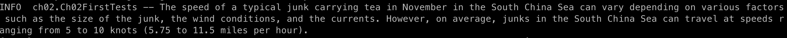

= Getting Started
:chapter: 2

== The Project Structure

This book is organized as a single Mavenfootnote:[Maven can be found at https://maven.apache.org/ . It's one of the two most popular build tools for the JVM ecosystem.] project, using Java 21footnote:[As this book is being written, Java 21 is the current release of Java with long-term support. There are lots of ways to download Java, but which one is best depends on your skill level and operating system. In a pinch, you can find it at https://jdk.java.net/21, but readers of this book are likely to already have a JVM installed. We only included this footnote because _every other book_ has stuff on installing tools and we didn't want to feel left out.].
Installing these tools is beyond the scope of this book; consider asking tools like ChatGPT for advice for your operating system!

Maven uses a fairly verbose object model, written with XML, to describe projects.
This was chosen here because it involves _fewer_ files (a pom.xml can describe a project completely) and Maven has demonstrated excellent compatibility across versions, whereas Gradle - the other popular build tool for the JVM - has much shorter build scripts, but uses _multiple_ build scripts for each project, and it's focused more on feature sets than compatibility.

We don't have a preference between Maven or Gradle in reality, but in a book, tool stability is _critical_.

This book's project is called `bsai-code`.
It contains _modules_, named after each chapter, so the top-level project contains modules named `chapter02`, `chapter03`, and so forth.
The top-level project serves to centralize the dependencies that *every* module needs, which means that in our case it makes sure the Spring dependencies are consistent.

Each chapter has a directory structure, an effective standard across Java projects, that looks like this:

.Listing {chapter}-{counter:listing}: The standard Maven directory structure
[source,shell]
----
.
./src
./src/main/java
./src/main/resources
./src/test/java
./src/test/resources
----

This can be created in the "project directory" with the following command, if you're running a POSIX shell like `bash` or `zsh`:

.Listing {chapter}-{counter:listing}: Creating the project directory structure in POSIX
[source,shell]
----
mkdir src/{main,test}/{java,resources}
----

This is all fairly standard for Java programmers; it's being included here for completeness more than anything else.
Project listings are offsets from the "book's project directory", so the following listing is in the "top level" directory:

.Listing {chapter}-{counter:listing}: `pom.xml`
[source,xml]
----
include::../../../../code/pom.xml[]
----

This is _this chapter's_ project file, and thus it's in a directory _under_ the top level directory, called `chapter02`, and the file is named `pom.xml`.
It's fairly straightforward in and of itself, including the dependencies we need to access Spring AI: the OpenAI starter (`spring-ai-openai-spring-boot-starter`), `spring-boot-starter-web` because we need some classes from it to provide services for OpenAI, a test starter (`spring-boot-starter-test`, excluding an android JSON library because we don't need it and Spring will warn us about duplication otherwise), and `commons-math3`, because we'll want to use some simple mathematics operations later in this chapter and we don't want to have to write the code ourselves.

.Listing {chapter}-{counter:listing}: `chapter02/pom.xml`
[source,xml]
----
include::../../../../code/chapter02/pom.xml[]
----

We'll want one more file to save ourselves a lot of unnecessary duplication: an `.env` file.
This file is going to hold our OpenAI access key.
This is a simple name/value pair, and this file goes into the root of our project structure.

Listing {chapter}-{counter:listing}: `.env`

[source,shell]
----
OPENAI_API_KEY=[your-api-key-value-here]
----

Thus, we should have a project structure that looks like this, so far:

.Listing {chapter}-{counter:listing}: The project structure early in Chapter Two
[source,shell]
----
> tree
.
├── .env
├── chapter02
│   ├── pom.xml
│   └── src
│       ├── main
│       │   ├── java
│       │   └── resources
│       └── test
│           ├── java
│           └── resources
└── pom.xml
----

All that's very exciting and good, but it's time to actually write some code and show some basic functionality.

== Spring AI

Spring AI builds around the idea of a _Model_.
A model accepts a request and feeds back a response in some format; chat models use text, there are also image models, and audio models.
There's even a model _abstraction_ to provide for mechanisms that haven't necessarily been anticipated yetfootnote:[Imagine an AI that responds with peanut butter and jelly sandwiches! ... or don't, we don't mind.].

There are variants for even the coarse abstractions: a chat model, for example, has a blocking version and a streaming version, where the blocking version returns a 'complete answer' and the streaming version returns the answer in intermediate steps, much as a human would as they type out a response.

In simplest form, to use Spring AI, you acquire a model, with appropriate configuration to inform the model of what sources to use, and issue a call to get the response.
That sounds so simple that we should build something and test it out.

NOTE: We've chosen to use OpenAI for the base service for this book.
As Chapter One mentioned, this is a commercial service; you'll need to set up an API key for use, and in the process of running the examples in this book, you _will_ consume resources on OpenAI that may incur a cost.
This was done because OpenAI is commercial and _predictable_.
We know the resources it has available.
Ollama is free, but has very high demands in terms of hardware; it is *certainly* possible to use Ollama instead of OpenAI, but we chose to focus on reproducible results for the reader; OpenAI tends to be faster and doesn't rely on the reader having a relatively high end CPU/GPU combination with plenty of disk space.

We need to build a configuration first.
This is done in two places: the `.env` file mentioned in the prior section (see Listing {chapter}-5) and in a Spring configuration class.

=== Getting the OpenAI key

To get your OpenAI key, you'll need to go to `https://platform.openai.com/` and create an account.
From there, you'll go to "Settings" - the gear on the page - and see this screen:

.The OpenAI Settings Screen
image::images/ch01-openai-settings.png[]

We need to use a _project key_, so select "Create project" in the menu on the left hand side of the page.

.Creating a project on OpenAI.com
image::images/ch01-openai-create-project.png[]

Enter a project name that makes sense for you (we chose "Beginning Spring AI") and you'll see a page with a _project key_ on it, like this:

.The Project settings on OpenAI.com
image::images/ch01-openai-project-key.png[]

The next thing we need to do is create an API key.
In the profile, it gives you a chance to manage the permissions for various keys; as this is being written, this defaults to managing the API keys _per user_, but this is being deprecated for the use of _project keys_.

WARNING: This is all under active development, so the user interface may have changed since this was written.

Select the project in the top of the window (where we have "Beginning Spring AI") and you'll see an option for "API keys" on the right side.
Selecting this link gives you a chance to create new secrets - the API keys you need.
When you generate these, save them somewhere safe - and use set the value in the `.env` file for use by Spring AI.
The value you'll want should look like `sk-proj-` followed by a number of other letters.

If you lose this key, all you need to do is create a new one - but OpenAI doesn't show you the keys again.

The value in the "Project ID" field is what we'll put in the `.env` file.

.The Project settings on OpenAI.com
image::images/ch01-openai-secret-key.png[]

That's a lot of setup!
Thankfully, we won't need to do it more than once for this book, unless the original secret key is lost.
It's time to code.

=== Our First OpenAI Query

The first thing we need to handle in any Spring application is the application configuration itself.
Spring has a lot of very flexible approaches to configuration, and those approaches deserve their own bookfootnote:[In fact, Spring configuration not only deserves its own book, but there are multiple books that cover Spring configuration very well.].
We're going to use a simple approach to Spring configuration, so our application will look as simple as possible.

.Listing {chapter}-{counter:listing}: `chapter02/src/main/java/ch02/Ch02Configuration.java`
[source,java]
----
include::../../../../code/chapter02/src/main/java/ch02/Ch02Configuration.java[]
----

That's it.
We're going to use `@Service` to mark resources that Spring will scan and configure for us.
With that said, it's time to look at how Spring AI's `ChatClient` actually works.

A `ChatClient` uses a `Prompt` to interact with the language model.
A `Prompt` might be as simple as a block of text, but can configure what model is being used, the accepted variability of the response, and a host of other options.
These can be controlled at the point of the request, in code, but we can also control them in our application properties.
We'll need to set the API key, in any event, so let's take a look at the some of the more useful properties we can set.

[cols="1,2"]
|===
| Property name
| Description

| `spring.ai.openai.api-key`
| The API key to be used by the application

| `spring.ai.openai.chat.options.temperature`
| This determines the variability of the responses. A high temperature means the model generates more diverse answers, and a low temperature means the answers are more deterministic.

| `spring.ai.openai.chat.options.model`
| This is the name of the model to use. This addresses the _type_ of trainings used as well as the _cost_ of the trainings used. The model names, and their prices, can be found at `https://openai.com/api/pricing/`;
|===

NOTE: Astute readers will see the use of `openai` in those properties.
Each specific Spring AI implementation has its own variation of these values; if you're using Ollama, for example, you'd set the default model with `spring.ai.ollama.chat.options.model` instead.

There are certainly more options that can be played with, of course, and we'll cover them as needed.

Typically, we're going to center on an inexpensive and relatively low-powered model (`gpt-3.5-turbo`) for this book, because we're more concerned with how the Spring AI API works _with_ the models, rather than being concerned with the output of the models themselves.

We need to at least provide the API key to our chapter's code, and we want the model to be as deterministic as possible for now, so here's our `application.properties`.
This is all very test-centric, so we're going to place it in `chapter02/src/test/resources`.
Note the use of `spring.config.import`, which allows us to load our `.env` file's values for internal use.

.Listing {chapter}-{counter:listing}: `chapter02/src/test/resources/application.properties`
[source,properties]
----
include::../../../../code/chapter02/src/test/resources/application.properties[]
----

Let's take a look at a simple chat "client" - a test that demonstrates how we might wish to interact with class that uses Spring AI.
(We're going to look at the client next, we promise.)

This test is fundamentally simple: it loads the Spring configuration for testing, and issues a simple request to OpenAI.
We're going to ask a question about the speed of a particular kind of boat carrying tea in a specific body of water; we don't care about the *actual response*, but given that we're setting `spring.ai.openai.chat.options.temperature` to `0.0`, we expect the answers to be pretty consistent across requests, and we can example the output for expected values to determine if the query response is "right."

.Listing {chapter}-{counter:listing}: `chapter02/src/test/java/ch02/Ch02FirstTests.java`
[source,java]
----
include::../../../../code/chapter02/src/test/java/ch02/FirstTests.java[]
----

****
For the record, the response OpenAI gave for this prompt as this chapter was being written was: "The speed of a typical junk carrying tea in November in the South China Sea can vary depending on various factors such as the size of the junk, the wind conditions, and the currents.
However, on average, junks can travel at speeds ranging from 5 to 10 knots (5.75 to 11.5 mph) in calm weather conditions."

This is mildly fascinating in and of itself, but note how we're having to phrase the query.
This book isn't about writing efficient or effective queries, but we're going to modify how this prompt is constructed to make it a little more targeted for our purposes over time.
****

Of course, we can't _run_ this yet, because we don't have `FirstChatService` implemented.

Our `FirstChatService` has one public method in it, `query(String)`, which returns a `String`.
This method represents the _essential_ mechanism that _every call in Spring AI will follow_, although there are a lot of variations we can apply.

First we have to have a `Client` available (in this case, a `ChatClient`).
We'll use Spring's dependency injection to get a `ChatClient.Builder` provided, as one is automatically provided by Spring AI.

Next, to issue a call, we build a `Prompt`; there are a number of variations here, but we're going to use the simplest first, and rely on the default options from `application.properties` to determine temperature and model.

Once we have a prompt, we issue a call to the API, whether blocking or streaming; in this case, we don't care about streaming, so we use `call()` to get the response specification.

Once we have the response specification, we can get the simple content by using the `content()` method; this is a short form of `getResult().getOutput().getContent()`.
If we wanted to, we could get metadata about the call like the number of tokens consumed on our API key and a few other interesting elements.

This sounds pretty straightforward, so let's see what the actual Java class looks like.

.Listing {chapter}-{counter:listing}: `chapter02/src/main/java/ch02/service/FirstChatService.java`
[source,java]
----
include::../../../../code/chapter02/src/main/java/ch02/service/FirstChatService.java[]
----

Now we actually have something we can test.
We can run this chapter's test suite by using Maven:

[source,shell]
----
mvn -am -pl chapter02 clean test
----

If everything works properly, we should see output that looks something like this screenshot, in part:

.The Output from `Ch02FirstTests`


== Choosing a Different Model

The model being specified here is, as mentioned, `gpt-3.5-turbo`, which is an inexpensive, somewhat dated model.
There are _many_ different models to choose from, with the "most current" on OpenAI being the `gpt-4o` model.
We could set it as the default in `application.properties`, but we can also provide options to the `Prompt` and set it there.
Let's see that in action, with a `OptionChatService` that allows us to provide `ChatOptions`, and then we'll show a test that uses it.

.Listing {chapter}-{counter:listing}: `chapter02/src/main/java/ch02/service/OptionChatService.java`
[source,java]
----
include::../../../../code/chapter02/src/main/java/ch02/service/OptionChatService.java[]
----

This overloads the `query` method from `FirstChatService` to also accept an `OpenAiChatOptions` instance.
To use it, all we have to do is pass it to the creation of the `Prompt`.
After that, the call follows the same pattern as we saw in `FirstChatService` to the letter.

****
As with the `openai` properties in our configuration file, different Spring AI libraries have different capabilities.
We're targeting OpenAI here, but there are variants for the other LLM implementations that reflect the options those services provide.
There is a `ChatOptions` object that exposes generalized parameters - like `temperature` - but not every LLM allows us to select a model on the fly like OpenAI does, so we're going to limit ourselves to the `OpenAiChatOptions` type here.
****

Astute readers might wish to invert the service' calls, such that `query(String)` constructs a default `ChatOptions` and passes it to the more flexible `query(String, OpenAiChatOptions)` method.
This makes a lot of sense, and in a "real project" that would certainly be advisable - but in a "real project" you wouldn't have multiple instances like this.
This code is being constructed for the purpose of education, not an example to followfootnote:[It's not an example to follow _unless you're writing your own book_, we suppose, and if you follow our example _there_, consider us flattered.].

Let's show this in action, and let's set the model to `gpt-4o`.
There are other options we can set - `temperature`, for example - and we'll see that next.
Let's keep ourselves looking at the model for now.

.Listing {chapter}-{counter:listing}: `chapter02/src/test/java/ch02/Ch02OptionTests.java`
[source,java]
----
include::../../../../code/chapter02/src/test/java/ch02/OptionTests.java[]
----

The output for this execution is relatively variable (thanks to the default temperature of queries) but one run locally generated this outputfootnote:[We're going to stick on the subject of junks, which are, according to Wikipedia, "a type of Chinese sailing ship characterized by a central rudder, an overhanging flat transom, watertight bulkheads, and a flat-bottomed design." The subject was chosen mostly to avoid referring to African laden swallows, which - let's be real - nobody cares about.]:

[source,text]
----
The speed of a typical junk (a traditional Chinese sailing ship) carrying tea in the South China Sea can vary based on several factors, including the design of the junk, the skill of the crew, and the specific weather and sea conditions. However, under clear weather and standard currents, a traditional junk might typically travel at speeds ranging from 4 to 8 knots (approximately 4.6 to 9.2 miles per hour or 7.4 to 14.8 kilometers per hour).

It's important to note that these speeds are general estimates and can vary. Modern adaptations or motorized junks could achieve different speeds.
----

== Temperature

We've described temperature as "determining the variability of the responses" from a language model.
It turns out that there are two parameters that have similar effects on how an LLM generates content: one is `temperature`, and the other is `top_p`, which refers to "probability mass." Both refer to how content is selected by the LLM.

Lower `top_p` and `temperature` values indicate less variability in the responses.
The ranges for the values are slightly different: `top_p` refers to a percentage of things to consider (so `0.10` means "consider the most relevant tokens" and `1.0` would mean "don't filter tokens at all"), and `temperature` refers to how tokens are selected, with a range from `0.0` to `2.0`, where `2.0` indicates very high variability.

One would use _either_ `top_p` or `temperature` - you don't use them both.
(However, it's not going to be an programmatic error to _set_ them both - the documentation isn't clear on what happens in the service itself when both are used.)

_Specifying_ either one is trivial: in the code where we build the `OpenAiChatOptions`, simply include a `temperature` value, for example:

[source,java]
----
var options=OpenAiChatOptions.builder()
    .withModel("gpt-4o")
    .withTemperature(1.0f)
    .build();
----

We use the archaic `1.0f` form for the float because Java is strongly typed, and the actual parameter is a `Float` - which the compiler won't normally translate `1.0`, a `double`, to a `Float` for us.
Normally, Java's strong typing works in our favor, but the use of `Float` in the API makes this slightly problematic, if by "problematic" we mean that we have to use the narrower type.

There are two questions to ask here: one is "What does this mean for our code?," and the other is "What actual impact does it have?" - with the latter question being more important.

It's not easy to answer, in a concrete sense. Both `temperature` and `top_p` serve as inputs for the language model, basically "churning the water" for output. The `top_p` parameter, for example, controls what elements are selected for generating output: if you imagined a list of colors ordered by popularity, `top_p` might provide a way to suggest selecting the _more popular_ colors rather than the colors at random (by limiting the selection to the "top colors," so to speak.) Temperature also refers to how things are selected in the model.

As a result, a higher `temperature` or `top_p` value provides a wider range of inputs for the generation of a response, which makes it "more variable."

So how do we *measure* this, such that we can demonstrate it?

What we need to do is have a way to describe similarity between blocks of text.
This is, luckily for us, a known thing.
There are _lots_ of ways to measure similarity, but we're going to use a simple one, called a Jaccard similarity, which is basically a measure of the number of common elements between two sets against the measure of elements that they _don't_ have in commonfootnote:[To learn more about Jaccard similarity, see `https://www.learndatasci.com/glossary/jaccard-similarity/` - and there are *definitely* other ways to measure similarities between texts, but a Jaccard similarity is effective enough for our purposes *and* it's relatively little code, so you're not having to pore through seven pages of Lucene example code.].

To build the corpus, the body text, for similarity, we're going to extract n-grams from text; n-grams are sequences of tokens in a specific order. An example of a set of n-grams of length two from the, well, definition of n-grams might look like this:

```
n-grams are
are sequences
sequences of
of tokens
tokens in
in a
a specific
specific order
```

If you built n-grams of length three, you'd get this set:

```
n-grams are sequences
are sequences of
sequences of tokens
of tokens in
tokens in a
in a specific
a specific order
```

We can compare the set of n-grams generated from "constant" queries - queries with very low `temperature` or `top_p` values - and compare them to queries with higher variability. If our supposition is correct - that the higher values have higher variability - we should see *increasing* variations in those sets of n-grams over time.

Let's create a Spring bean to give us a Jaccard similarity score:

.Listing {chapter}-{counter:listing}: `chapter02/src/main/java/ch02/service/JaccardSimilarityCalculator.java`
[source,java]
----
include::../../../../code/chapter02/src/main/java/ch02/service/JaccardSimilarityCalculator.java[]
----

This is fairly easy to demonstrate, and we don't trust code without tests - or we shouldn't - so let's see it in action, before we apply it to our conversations with an LLM.

.Listing {chapter}-{counter:listing}: `chapter02/src/test/java/ch02/JaccardTests.java`
[source,java]
----
include::../../../../code/chapter02/src/test/java/ch02/JaccardTests.java[]
----

Here, we have a _parameterized test_, a JUnit feature that allows us to specify a list of arguments that we can throw at a single method.
We have three sets of data: one set is a comparison of identical texts, that should have a _very high similarity_, and another set of texts (that we typed very quickly, thank you very much) that have relatively little similarity. Their n-grams are just too different, which is what we expect.


The similarity of `1.0` for the first input means those texts are likely to be identical (as, in fact, they are, but similarity scores _usually_ trim out things like incidental words and punctuation, which we're not quite doing here).

The similarity score of `0.00` means that the second set of inputs are very different, as we expect, since the number of common n-grams is very low.

Our last test has *one word* of difference - `this will do` and `this might do` - which means we have two n-grams that differ. Here are the n-grams (with a size of `3`) for those last two inputs:

[cols="1,1,1"]
|===
| First input
| Second input
| Same?

| this is some
| this is some
| yes

| is some cool
| is some cool
| yes

| some cool text
| some cool text
| yes

| cool text more
| cool text more
| yes

| text more is
| text more is
| yes

| more is better
| more is better
| yes

| is better but
| is better but
| yes

| better but this
| better but this
| yes

| but this will
| but this might
| no

| this will do
| this might do
| no
|===

Anyway, _now_ we have a pattern that we can use to throw at an LLM, with different `temperature` and `top_p` values, and and we can measure those parameters' effect on the resultsfootnote:[And you readers probably thought we just wanted to type "Jaccard" out a lot, to show off, didn't you?].

Our methodology here is relatively simple. We're going to test both `top_p` and `temperature`, increasing the value for multiple queries, and measure the similarity to our initial response.

What we _expect_ is that the first test (the initial response, compared to the initial response) is _very similar_ (as it should be, being the same content), and as we increase the `temperature`, our similarity score should decrease. We don't _know_ that it will decrease, because that's how sampling mechanisms work - we might just _happen_ to get an identical response by random chance - but we expect that overall the similarity should decrease.

With `top_p` it's a lot harder to measure, because of the nature of our query, but we're going to try anyway - we expect the slope to be _close to 0 or negative_ but not necessarily negative, because `top_p` really changes the selection set for the data and not the _variability_ of the data the way `temperature` does - but we're going to take a look at it anyway.

We use a `SimpleRegression` to calculate the slope of the similarity to measure this. The way this works is that we basically plot the similarity score along an X/Y axis; the "sample number" is the X axis and the "similarity" is the Y axis. We expect the numbers to go down along the X axis, thus we expect a negative slope, *even if* a given point along the X axis is higher than its precedent.

Let's take a look at our actual test:

.Listing {chapter}-{counter:listing}: `chapter02/src/test/java/ch02/VariabilityTests.java`
[source,java]
----
include::../../../../code/chapter02/src/test/java/ch02/VariabilityTests.java[]
----

When we run this, we get a happy little graph of stars that demonstrate the similarity. The numbers will vary quite a bit based on each individual run; it's _quite possible_ that you might get a test failure because the LLM just happens to generate some outputs with higher similarities. With that said, though, we haven't gotten many actual test failures based on the similarities going up.

NOTE: With that said, we _have_ gotten test failures, particularly with `top_p`. It's because of the way these values work: they change the sampling data for the language models, so sometimes you get variable results. if you run these tests and get failures, it's not entirely unexpected, just like a test of a random number generator _should_ give you an equal distribution of results but occasionally the universe just says, "no, you're getting similar numbers back for a while." Getting that kind of result *consistently* is bad, but it _does_ happen.

== Conversations and Roles

What we've seen so far is a fairly simple query mechanism, a rough analogy to a single query to a given LLM, although we've given ourselves a way to control how variable a given response might be. That's useful, but not very; it means that every query exists in a sort of standalone universefootnote:[Our "variability tests" with `temperature` relied on each query being standalone.].

Given that LLMs are presented as conversational, it's time for us to see how that works and how we can manage a conversation with Spring AI.

== Next Steps

In our next chapter, ...