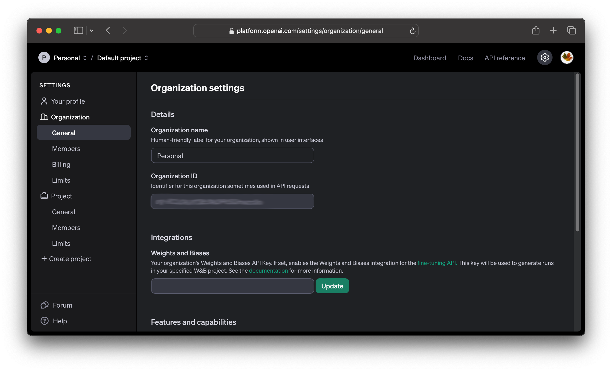
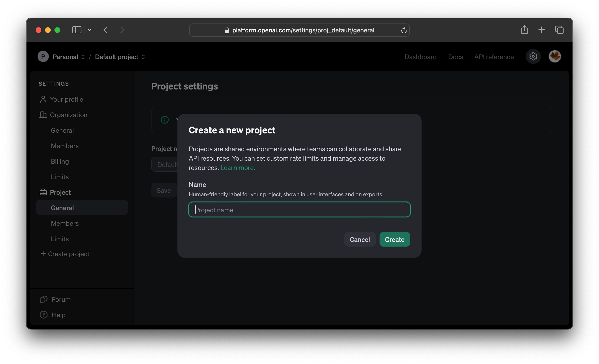
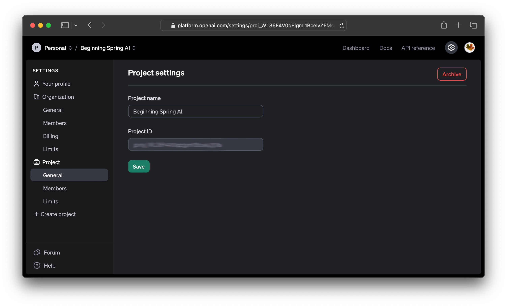
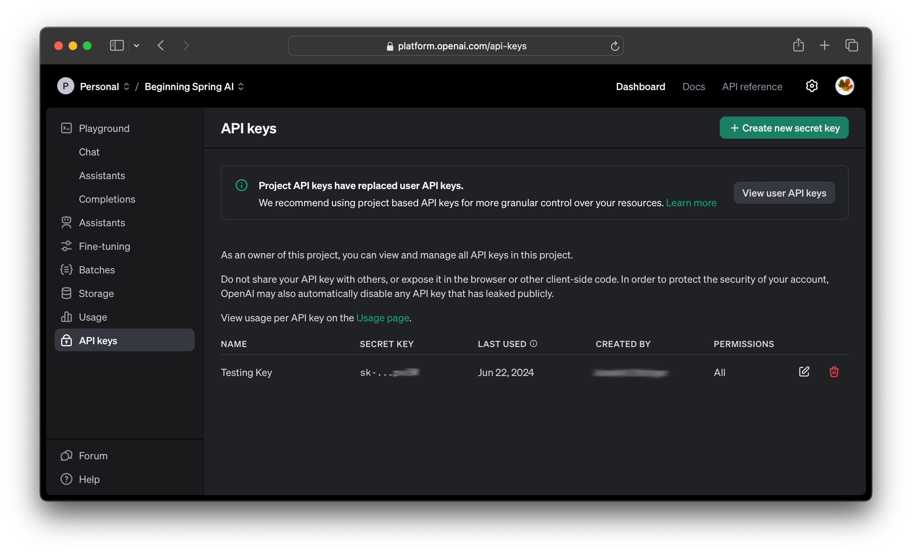

= Getting Started
:chapter: 2

== The Project Structure

This book is organized as a single Mavenfootnote:[Maven can be found at https://maven.apache.org/ . It's one of the two most popular build tools for the JVM ecosystem.] project, using Java 21footnote:[As this book is being written, Java 21 is the current release of Java with long-term support. There are lots of ways to download Java, but which one is best depends on your skill level and operating system. In a pinch, you can find it at https://jdk.java.net/21, but readers of this book are likely to already have a JVM installed. We only included this footnote because _every other book_ has stuff on installing tools and we didn't want to feel left out.].
Installing these tools is beyond the scope of this book; consider asking tools like ChatGPT for advice for your operating system!

Maven uses a fairly verbose object model, written with XML, to describe projects. This was chosen here because it involves _fewer_ files (a pom.xml can describe a project completely) and Maven has demonstrated excellent compatibility across versions, whereas Gradle - the other popular build tool for the JVM - has much shorter build scripts, but uses _multiple_ build scripts for each project, and it's focused more on feature sets than compatibility.

We don't have a preference between Maven or Gradle in reality, but in a book, tool stability is _critical_.

This book's project is called `bsai-code`. It contains _modules_, named after each chapter, so the top-level project contains modules named `chapter02`, `chapter03`, and so forth. The top-level project serves to centralize the dependencies that *every* module needs, which means that in our case it makes sure the Spring dependencies are consistent.

Each chapter has a directory structure, an effective standard across Java projects, that looks like this:

.Listing {chapter}-{counter:listing}: The standard Maven directory structure
```shell
.
./src
./src/main/java
./src/main/resources
./src/test/java
./src/test/resources
```

This can be created in the "project directory" with the following command, if you're running a POSIX shell like `bash` or `zsh`:

.Listing {chapter}-{counter:listing}: Creating the project directory structure in POSIX
```shell
mkdir src/{main,test}/{java,resources}
```

This is all fairly standard for Java programmers; it's being included here for completeness more than anything else. Project listings are offsets from the "book's project directory", so the following listing is in the "top level" directory:

.Listing {chapter}-{counter:listing}: `pom.xml`
```xml
include::../../../../code/pom.xml[]
```

This is _this chapter's_ project file, and thus it's in a directory _under_ the top level directory, called `chapter02`, and the file is named `pom.xml`.

.Listing {chapter}-{counter:listing}: `chapter02/pom.xml`
```xml
include::../../../../code/chapter02/pom.xml[]
```

We'll want one more file to save ourselves a lot of unnecessary duplication: an `.env` file. This file is going to hold our OpenAI access key. This is a simple name/value pair, and this file goes into the root of our project structure.

Listing {chapter}-{counter:listing}: `.env`
```shell
OPENAI_API_KEY=[your-api-key-value-here]
```

Thus, we should have a project structure that looks like this, so far:

.Listing {chapter}-{counter:listing}: The project structure early in Chapter Two
```shell
> tree
.
├── .env
├── chapter02
│   ├── pom.xml
│   └── src
│       ├── main
│       │   ├── java
│       │   └── resources
│       └── test
│           ├── java
│           └── resources
└── pom.xml
```

All that's very exciting and good, but it's time to actually write some code and show some basic functionality.

== Spring AI

Spring AI builds around the idea of a _Model_. A model accepts a request and feeds back a response in some format; chat models use text, there are also image models, and audio models. There's even a model _abstraction_ to provide for mechanisms that haven't necessarily been anticipated yetfootnote:[Imagine an AI that response with peanut butter and jelly sandwiches! ... or don't, we don't mind.].

There are variants for even the coarse abstractions: a chat model, for example, has a blocking version and a streaming version, where the blocking version returns a 'complete answer' and the streaming version returns the answer in intermediate steps, much as a human would as they type out a response.

In simplest form, to use Spring AI, you acquire a model, with appropriate configuration to inform the model of what sources to use, and issue a call to get the response. That sounds so simple that we should build something and test it out.

NOTE: We've chosen to use OpenAI for the base service for this book. As Chapter One mentioned, this is a commercial service; you'll need to set up an API key for use, and in the process of running the examples in this book, you _will_ consume resources on OpenAI that may incur a cost. This was done because OpenAI is commercial and _predictable_. We know the resources it has available. Ollama is free, but has very high demands in terms of hardware; it is *certainly* possible to use Ollama instead of OpenAI, but we chose to focus on reproducible results for the reader; OpenAI tends to be faster and doesn't rely on the reader having a relatively high end CPU/GPU combination with plenty of disk space.

We need to build a configuration first. This is done in two places: the `.env` file mentioned in the prior section (see Listing {chapter}-5) and in a Spring configuration class.

=== Getting the OpenAI key

To get your OpenAI key, you'll need to go to `https://platform.openai.com/` and create an account. From there, you'll go to "Settings" - the gear on the page - and see this screen:

.The OpenAI Settings Screen


We need to use a _project key_, so select "Create project" in the menu on the left hand side of the page.

.Creating a project on OpenAI.com


Enter a project name that makes sense for you (we chose "Beginning Spring AI") and you'll see a page with a _project key_ on it, like this:

.The Project settings on OpenAI.com


The next thing we need to do is create an API key. In the profile, it gives you a chance to manage the permissions for various keys; as this is being written, this defaults to managing the API keys _per user_, but this is being deprecated for the use of _project keys_.

WARNING: This is all under active development, so the user interface may have changed since this was written.

Select the project in the top of the window (where we have "Beginning Spring AI") and you'll see an option for "API keys" on the right side. Selecting this link gives you a chance to create new secrets - the API keys you need. When you generate these, save them somewhere safe - and use set the value in the `.env` file for use by Spring AI. The value you'll want should look like `sk-proj-` followed by a number of other letters.

If you lose this key, all you need to do is create a new one - but OpenAI doesn't show you the keys again.

The value in the "Project ID" field is what we'll put in the `.env` file.

.The Project settings on OpenAI.com


That's a lot of setup! Thankfully, we won't need to do it more than once for this book, unless the original secret key is lost. It's time to code.

=== Our First OpenAI Query

The first thing we need to handle in any Spring application is the application configuration itself. Spring has a lot of very flexible approaches to configuration, and those approaches deserve their own bookfootnote:[In fact, Spring configuration not only deserves its own book, but there are multiple books that cover Spring configuration very well.]. We're going to use a simple approach to Spring configuration, so our application will look as simple as possible.

.Listing {chapter}-{counter:listing}: `chapter02/src/main/java/ch02/Ch02Configuration.java`
```java
include::../../../../code/chapter02/src/main/java/ch02/Ch02Configuration.java[]
```

That's it. We're going to use `@Service` to mark resources that Spring will scan and configure for us. With that said, it's time to look at how Spring AI's `ChatClient` actually works.

A `ChatClient` uses a `Prompt` to interact with the language model. A `Prompt` might be as simple as a block of text, but can configure what model is being used, the accepted variability of the response, and a host of other options. These can be controlled at the point of the request, in code, but we can also control them in our application properties. We'll need to set the API key, in any event, so let's take a look at the some of the more useful properties we can set.

[cols="1,2"]
|===
| Property name
| Description

| `spring.ai.openai.api-key`
| The API key to be used by the application

| `spring.ai.openai.chat.options.temperature`
| This determines the variability of the responses. A high temperature means the model generates more diverse answers, and a low temperature means the answers are more deterministic.

| `spring.ai.openai.chat.options.model`
| This is the name of the model to use. This addresses the _type_ of trainings used as well as the _cost_ of the trainings used. The model names, and their prices, can be found at `https://openai.com/api/pricing/`;
|===

NOTE: Astute readers will see the use of `openai` in those properties. Each specific Spring AI implementation has its own variation of these values; if you're using Ollama, for example, you'd set the default model with `spring.ai.ollama.chat.options.model` instead.

There are certainly more options that can be played with, of course, and we'll cover them as needed.

Typically, we're going to center on an inexpensive and relatively low-powered model (`gpt-3.5-turbo`) for this book, because we're more concerned with how the Spring AI API works _with_ the models, rather than being concerned with the output of the models themselves.

We need to at least provide the API key to our chapter's code, and we want the model to be as deterministic as possible for now, so here's our `application.properties`. This is all very test-centric, so we're going to place it in `chapter02/src/test/resources`. Note the use of `spring.config.import`, which allows us to load our `.env` file's values for internal use.

.Listing {chapter}-{counter:listing}: `chapter02/src/test/resources/application.properties`
```properties
include::../../../../code/chapter02/src/test/resources/application.properties[]
```

== Next Steps

In our next chapter, ...